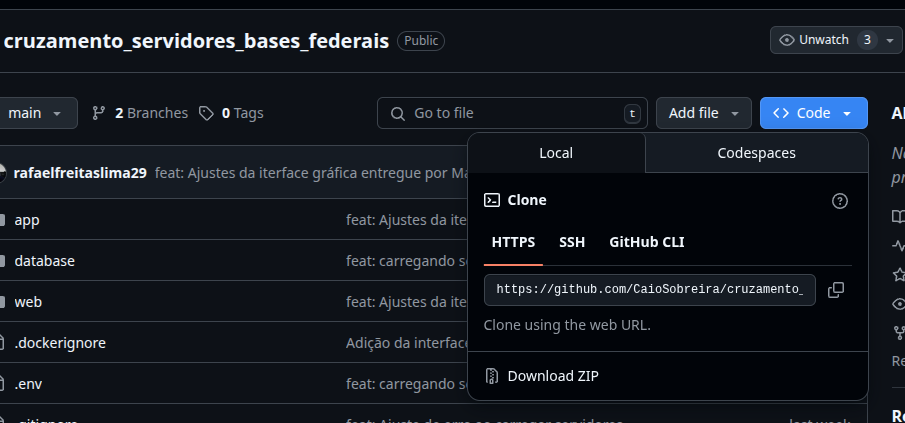
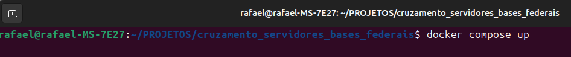
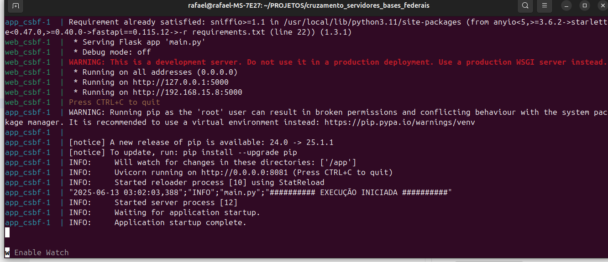
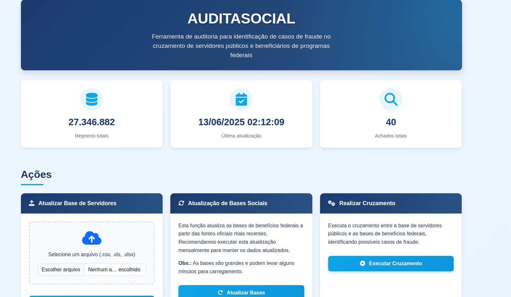

# Cruzamento Servidores Públicos vs. Bases de Benefícios Federais

Este projeto tem como objetivo fornecer um mecanismo para cruzamento de bases de dados para verificar se determinada relação de servidores públicos constam como recebedores de benefícios federais.

As seguintes bases de dados federais são utilizadas nos cruzamentos:
- Novo Bolsa Família
- BPC (Benefício de Prestação Continuada)
- Seguro Defeso

Os arquivos das respectivas bases são baixados automaticamente dos Dados Abertos do Portal da Transparência do Governo Federal: https://portaldatransparencia.gov.br/download-de-dados

O número do NIS é utilizado como campo chave nos cruzamentos, e portanto, é imprescindível a disponibilidade de uma relação de servidores contendo o número do NIS do ente federativo que irá utilizar esta ferramenta.

O usuário deverá gerar uma relação de servidores em arquivo no formato CSV em layout específico (detalhado abaixo) e colocar em uma pasta do projeto para execução dos cruzamentos.

Este projeto inclui um modo de teste, por meio do qual é realizada uma simulação com dados fictícios gerados aleatoriamente, para fins de demonstração da funcionalidade.

---
## Requisitos:

### Instalação Recomendada:

| Componente            | Observação                                 |
|:----------------------|--------------------------------------------|
| Sistema Operacional   | Qualquer Linux que possa instalar o Docker (Recomendação Ubuntu 22 ou 24) |
| Docker                | [Como instalar o Docker](https://docs.docker.com/engine/install/) |
| Processador | 4 Núcloes 64bits - Qualquer processador desktop com menos de 10 anos  |
| Memória Ram | 4-8 GB de Ram - foi testado em um 8GB, mas não passa de 3,5GB em um Ubuntu 22.04. |

### Possibilidades de instalação no Windows:

É possivel utilizar no Windows com a funcionalidade WSL2, que cria uma maquina virtual de servidor do linux no Windows.

| Componente  | Observação                                 |
|:------------|--------------------------------------------|
| Sistema Operacional | Windowns 10 ou 11 usando WSL2 [WSL2](https://learn.microsoft.com/pt-br/windows/wsl/install) |
| Docker     | [Como instalar o Docker](https://docs.docker.com/engine/install/) |
| Processador | 4 Núcloes 64bits - Qualquer processador desktop com menos de 5 anos  |
| Memória Ram | 8GB - Windons pede mais memória |

### Possibilidades de instalação no VirtualBox:

É possível instalar o Linux Ubuntu Desktop/Server usando o [VirtualBox](https://www.virtualbox.org/).

| Componente  | Observação                                 |
|:------------|--------------------------------------------|
| Sistema Operacional | VirtualBox criando Maquina Virtual Ununtu 22.04 |
| Docker     | [Como instalar o Docker](https://docs.docker.com/engine/install/) |
| Processador | 6 Núcloes 64bits - Qualquer processador desktop com menos de 5 anos  |
| Memória Ram | 8GB+ - Windons pede mais memória |

## Instalação:

**Passo 1 - Baixa o código fonte**: 

No repositório do GitHub [https://github.com/CaioSobreira/cruzamento_servidores_bases_federais](https://github.com/CaioSobreira/cruzamento_servidores_bases_federais) é possível clonar usando o comando:

<code>
git clone https://github.com/CaioSobreira/cruzamento_servidores_bases_federais.git
</code>

Ou 

Baixando o arquivo:

Extrair o arquivo Zip

**Passo 2 - Lavantar o Sistema**: 

Dentro da pasta do código fonte, execute no terminal, ou no CMD o comando:

<code>
docker compose up
</code>

Após Aparecer: "########## EXECUÇÃO INICIADA ##########", o sistema já está online.

**Passo 3 - Acessar o sistema**: 

Basta abrir o Navegador Web, de sua escolha, e escrever [http://localhost:5000/](http://localhost:5000/)

## Como utilizar: (EM DEV - ATUALIZANDO)

Para execução do projeto é necessário ter instaladas as ferramentas Docker e Docker Compose. 

## O que o Sistema faz: (EM DEV - ATUALIZANDO)

Como os arquivos CSV baixados e o banco de dados gerado são grandes, recomenda-se a disponibilidade de no mínimo 20 GB de espaço em disco.

Após clonar o repositório, o usuário deverá gerar uma cópia do arquivo `.env.example` e nomeá-la como `.env`, dentro do diretório`app`. Caso deseje, pode alterar as variáveis de configuração do banco de dados.

OBS: Caso o usuário queira apenas testar o funcionamento, sem fornecer dados de servidores reais para cruzamento, poderá utilizar a ferramenta no [modo teste](#utilizando-no-modo-teste). Para isto, deverá preencher a variável `MODO_TESTE=True`. Se optar por fazer isto, a etapa seguinte, de criar o arquivo CSV de servidores, é desnecessária.

Depois de configurar o `.env`, deverá colocar dentro do diretório `app/servidores` um arquivo CSV de nome `servidores_cruzamento.csv`, com estrutura detalhada a seguir:

- Caractere separador: `;` (ponto-e-vírgula)
- Encoding: UTF-8
- Colunas **(o arquivo deverá ter um cabeçalho com as colunas com os nomes descritos abaixo, nesta ordem)**:
  - `nome`: Nome do servidor
  - `cpf`: CPF do servidor
  - `pis_pasep`: Corresponde ao número NIS do servidor **(essencial para o cruzamento)**
  - `vinculos`: Descrição do(s) vínculo(s) do servidor, onde sugere-se colocar dados referente ao(s) cargo(s), lotação(ões) e demais informações para auxiliar na análise
  - `remuneracao_bruta`: Total da remuneração bruta do servidor 

Após realizar os procedimentos acima, o usuário deve acessar a pasta raiz do projeto e executar o comando `docker compose up`.

A ferramenta irá criar automaticamente containers Docker com toda a infraestrutura necessária, incluindo banco de dados Postgres e projeto Python, baixar e carregar os arquivos do Portal da Transparência, bem como carregar o CSV de servidores fornecido, realizar os cruzamentos e gravar o resultado no arquivo `app/resultados/resultados_cruzamentos.xlsx`

Para fins de melhor desempenho, o script cria automaticamente índices nas colunas chave dos cruzamentos (referentes aos números NIS) em cada uma das tabelas.

Após a primeira execução, o banco de dados das bases ficará armazenado no diretório `pgdata`, gerenciado pelo Docker. Em execuções posteriores, o script irá primeiramente verificar se há atualizações das bases de dados federais, e só irá recarregar caso haja versões mais recentes das bases. 

Sendo assim, para uso cotidiano, basta o usuário substituir o arquivo de entrada `servidores_cruzamento.csv` por novas versões, sempre que desejar realizar novos cruzamentos.

---

